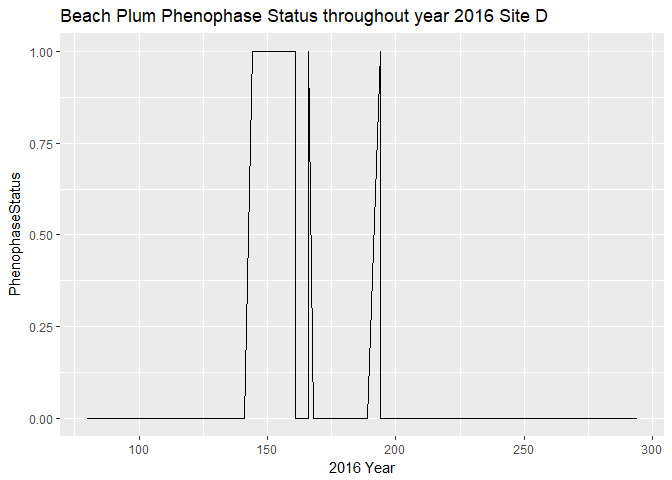
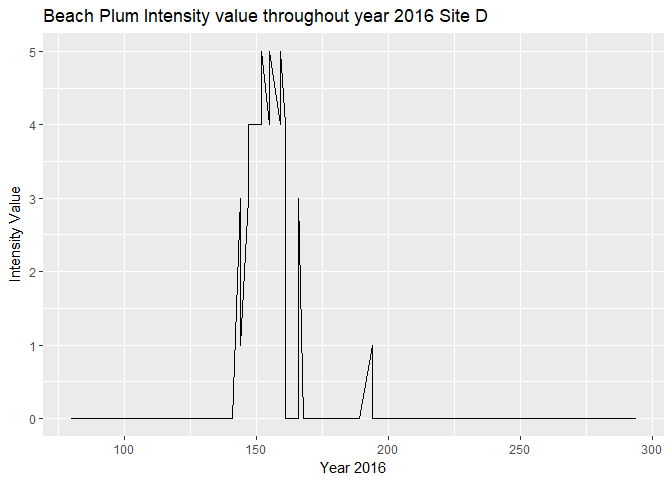

Plot For Species and Temperature
================
Karthik, Kim, Pallavi
November 5 2018

-   [Purpose](#purpose)
    -   [Research Questions](#research-questions)
        -   [Intensity Values](#intensity-values)
        -   [Data Source:](#data-source)
        -   [Data Files:](#data-files)
    -   [Plots to Answer our Research Question:](#plots-to-answer-our-research-question)
    -   [Year 2016](#year-2016)
        -   [Site D](#site-d)
        -   [Site E](#site-e)
        -   [Site G](#site-g)

------------------------------------------------------------------------

Purpose
=======

Purpose of the document is get the desired plot thats going to answer our research question, whether there is relation with the temperature and the breaking bud of our species.

Research Questions
------------------

In case of the beach plum phenophase we are interested in breaking of leaf bud over the years.

1)Whether Some species are reliant on spring temperature and the timing of breaking bud depends on the minimum spring temperature or average.

### Intensity Values

Breaking leaf buds
How many buds are breaking?
0----no phenophase
1----Less than 3
2----3 to 10
3----11 to 100
4----101 to 1000
5----1001 to 10000
6----more than 10000

### Data Source:

The data source is the Cleaned data uploaded in github(the cleaned data obtained on the species data and the temperature data)

### Data Files:

Data of the species BeachPlum at the different sites its present.

Site\_D\_BeachPlum.csv Site\_E\_BeachPlum.csv Site\_G\_BeachPlum.csv

Temperature Data file from the different sites recorded by the temperature logger for different years.

Min.Max\_SiteDJune2016.csv Min.Max\_SiteDMay2018.csv

Min.Max\_SiteEJune2016.csv Min.Max\_SiteEMay2018.csv

Min.Max\_SiteGJune2016.csv Min.Max\_SiteGMay2018.csv

Plots to Answer our Research Question:
--------------------------------------

Filter the site data based on the year, so that we can make a comparison of the intensity with the temperature of 2016.

Year 2016
---------

Filter the data of the species BeachPlum based on the Years and the sites where its present.

-   Create a New R script
-   Set the working directory with setwd()

``` r
knitr::opts_chunk$set(cache=TRUE)
knitr::opts_knit$set(root.dir = "D:/MS/Plotting/BeachPlumSiteData") 
```

### Site D

Load the Site\_D\_BeachPlum.csv file into a dataframe variable using the following R script

``` r
SiteD_BeachPlum<-read.csv("Site_D_BeachPlum.csv",stringsAsFactors = FALSE)
SiteD_BeachPlum$Observation_Date<-as.Date(SiteD_BeachPlum$Observation_Date,format("%m/%d/%Y"))
View(SiteD_BeachPlum)
str(SiteD_BeachPlum)
```

    ## 'data.frame':    461 obs. of  10 variables:
    ##  $ X.1                  : int  5441 5442 5443 5444 5445 5446 5447 5448 5449 5450 ...
    ##  $ X                    : int  56724 56725 56726 56727 56728 56729 56730 56731 56732 56733 ...
    ##  $ Site_Name            : chr  "Site D" "Site D" "Site D" "Site D" ...
    ##  $ Common_Name          : chr  "beach plum" "beach plum" "beach plum" "beach plum" ...
    ##  $ Phenophase_Name      : chr  "Breaking leaf buds" "Breaking leaf buds" "Breaking leaf buds" "Breaking leaf buds" ...
    ##  $ Observation_Date     : Date, format: "2017-03-22" "2017-04-03" ...
    ##  $ Day_of_Year          : int  81 93 101 108 117 123 129 136 142 150 ...
    ##  $ Phenophase_Status    : int  0 0 0 0 0 0 0 0 1 1 ...
    ##  $ Intensity_Category_ID: int  39 39 39 39 39 39 39 39 39 39 ...
    ##  $ Intensity_Value      : int  0 0 0 0 0 0 0 0 3 4 ...

``` r
SiteD_BeachPlum_2016<-subset(SiteD_BeachPlum, format(as.Date(SiteD_BeachPlum$Observation_Date),"%Y")==2016)
write.csv(SiteD_BeachPlum_2016,file = "SiteD_BeachPlum_2016.csv")
```

``` r
SiteD_Beach_2016<-read.csv("SiteD_BeachPlum_2016.csv",stringsAsFactors = FALSE,header = TRUE)
```

Changing Intensity Value to Number 

``` r
SiteD_BeachPlum_2016$Intensity_Value[grep("Less than 3",SiteD_BeachPlum_2016$Intensity_Value)]<-"1"

SiteD_BeachPlum_2016$Intensity_Value[grep("3 to 10",SiteD_BeachPlum_2016$Intensity_Value)]<-"2"

SiteD_BeachPlum_2016$Intensity_Value[grep("11 to 100",SiteD_BeachPlum_2016$Intensity_Value)]<-"3"

SiteD_BeachPlum_2016$Intensity_Value[grep("101 to 1,000",SiteD_BeachPlum_2016$Intensity_Value)]<-"4"

SiteD_BeachPlum_2016$Intensity_Value[grep("1,001 to 10,000",SiteD_BeachPlum_2016$Intensity_Value)]<-"5"

SiteD_BeachPlum_2016$Intensity_Value[grep("More than 10,000",SiteD_BeachPlum_2016$Intensity_Value)]<-"6"

SiteD_BeachPlum_2016$Intensity_Value[grep("-9999",SiteD_BeachPlum_2016$Intensity_Value)]<-"0"

```

Invoke the required libraries

``` r
library(dplyr)
```

    ## 
    ## Attaching package: 'dplyr'

    ## The following objects are masked from 'package:stats':
    ## 
    ##     filter, lag

    ## The following objects are masked from 'package:base':
    ## 
    ##     intersect, setdiff, setequal, union

``` r
library(ggplot2)
library(ggplot2)
library(gridExtra)
```

    ## 
    ## Attaching package: 'gridExtra'

    ## The following object is masked from 'package:dplyr':
    ## 
    ##     combine

#### Plotting the Phenophase status

Now lets plot the phenophase status of BeachPlum at site D over the year 2016.

``` r
ggplot(SiteD_Beach_2016, aes(SiteD_Beach_2016$Day_of_Year, SiteD_Beach_2016$Phenophase_Status
)) +ggtitle("Beach Plum Phenophase Status throughout year 2016 Site D")+ geom_line() + xlab("2016 Year") + ylab("PhenophaseStatus")
```



#### Plotting the Phenophase Intensity

``` r
ggplot(SiteD_Beach_2016, aes(SiteD_Beach_2016$Day_of_Year, SiteD_Beach_2016$Intensity_Value
)) +ggtitle("Beach Plum Intensity value throughout year 2016 Site D")+ geom_line() + xlab("Year 2016") + ylab("Intensity Value")
```



``` r
fig1<-ggplot(SiteD_Beach_2016, aes(SiteD_Beach_2016$Day_of_Year, SiteD_Beach_2016$Intensity_Value
)) +ggtitle("Beach Plum Intensity value throughout year 2016 Site D")+ geom_line() + xlab("Year 2016") + ylab("Intensity Value")
```

#### Plotting the Temperature at Site D for Year 2016

``` r
SiteDTemp2016<-read.csv("Min.Max_SiteDJune2016.csv")

SiteDTemp2016$Date<-as.Date(SiteDTemp2016$Date,format("%m/%d/%Y"))
```

``` r
ggplot(SiteDTemp2016, aes(SiteDTemp2016$Day, SiteDTemp2016$Min.Temp
))+ggtitle("Temperature Plot Site D BeachPlum") + geom_line() + xlab("2016 Year") + ylab("MinTemp")
```


``` r
fig2<-ggplot(SiteDTemp2016, aes(SiteDTemp2016$Day, SiteDTemp2016$Min.Temp
))+ggtitle("Temperature Plot Site D BeachPlum") + geom_line() + xlab("2016 Year") + ylab("MinTemp")
```

#### Comparison

``` r
grid.arrange(fig1,fig2,nrow=2)
```


### Site E

Load the Site\_E\_BeachPlum.csv into a dataframe variable using the following R script

``` r
Site_E_BeachPlum<-read.csv("Site_E_BeachPlum.csv",stringsAsFactors = FALSE)
Site_E_BeachPlum$Observation_Date<-as.Date(Site_E_BeachPlum$Observation_Date,format("%m/%d/%Y"))
View(Site_E_BeachPlum)
str(Site_E_BeachPlum)
```

    ## 'data.frame':    462 obs. of  10 variables:
    ##  $ X.1                  : int  7512 7513 7514 7515 7516 7517 7518 7519 7520 7521 ...
    ##  $ X                    : int  78174 78175 78176 78177 78178 78179 78180 78181 78182 78183 ...
    ##  $ Site_Name            : chr  "Site E" "Site E" "Site E" "Site E" ...
    ##  $ Common_Name          : chr  "beach plum" "beach plum" "beach plum" "beach plum" ...
    ##  $ Phenophase_Name      : chr  "Breaking leaf buds" "Breaking leaf buds" "Breaking leaf buds" "Breaking leaf buds" ...
    ##  $ Observation_Date     : Date, format: "2018-05-11" "2018-05-21" ...
    ##  $ Day_of_Year          : int  131 141 149 145 156 159 165 169 172 176 ...
    ##  $ Phenophase_Status    : int  0 0 0 0 1 1 1 0 1 1 ...
    ##  $ Intensity_Category_ID: int  39 39 39 39 39 39 39 39 39 39 ...
    ##  $ Intensity_Value      : int  0 0 0 0 3 3 3 0 3 3 ...

``` r
Site_E_BeachPlum_2016<-subset(Site_E_BeachPlum,format(as.Date(Site_E_BeachPlum$Observation_Date),"%Y")==2016)
write.csv(Site_E_BeachPlum_2016,file = "Site_E_BeachPlum_2016.csv")
```

``` r
SiteE_Beach_2016<-read.csv("Site_E_BeachPlum_2016.csv",stringsAsFactors = FALSE,header = TRUE)
```

#### Plotting the Phenophase status

Now lets plot the phenophase status of BeachPlum at site D over the year 2016.

``` r
ggplot(SiteE_Beach_2016, aes(SiteE_Beach_2016$Day_of_Year, SiteE_Beach_2016$Phenophase_Status
)) +ggtitle("Beach Plum Phenophase Status throughout year 2016 Site E")+ geom_line() + xlab("2016 Year") + ylab("PhenophaseStatus")
```


#### Plotting the Phenophase Intensity

``` r
ggplot(SiteE_Beach_2016, aes(SiteE_Beach_2016$Day_of_Year, SiteE_Beach_2016$Intensity_Value
)) +ggtitle("Beach Plum Intensity value throughout year 2016 Site E")+ geom_line() + xlab("Year 2016") + ylab("Intensity Value")
```


``` r
fig3<-ggplot(SiteE_Beach_2016, aes(SiteE_Beach_2016$Day_of_Year, SiteE_Beach_2016$Intensity_Value
)) +ggtitle("Beach Plum Intensity value throughout year 2016 Site E")+ geom_line() + xlab("Year 2016") + ylab("Intensity Value")
```

#### Plotting the Temperature at Site E for Year 2016

``` r
SiteETemp2016<-read.csv("Min.Max_SiteEJune2016.csv")

SiteETemp2016$Date<-as.Date(SiteETemp2016$Date,format("%m/%d/%Y"))
```

``` r
ggplot(SiteETemp2016, aes(SiteETemp2016$Day, SiteETemp2016$Min.Temp
))+ggtitle("Temperature Plot Site E BeachPlum") + geom_line() + xlab("2016 Year") + ylab("MinTemp")
```


``` r
fig4<-ggplot(SiteETemp2016, aes(SiteETemp2016$Day, SiteETemp2016$Min.Temp
))+ggtitle("Temperature Plot Site E BeachPlum") + geom_line() + xlab("2016 Year") + ylab("MinTemp")
```

#### Comparison

``` r
grid.arrange(fig3,fig4,nrow=2)
```


### Site G

Load the Site\_G\_BeachPlum.csv into a dataframe variable using the following R script

``` r
Site_G_BeachPlum<-read.csv("Site_G_BeachPlum.csv",stringsAsFactors = FALSE)
Site_G_BeachPlum$Observation_Date<-as.Date(Site_G_BeachPlum$Observation_Date,format("%m/%d/%Y"))
View(Site_G_BeachPlum)
str(Site_G_BeachPlum)
```

    ## 'data.frame':    458 obs. of  10 variables:
    ##  $ X.1                  : int  11391 11392 11393 11394 11395 11396 11397 11398 11399 11400 ...
    ##  $ X                    : int  118090 118091 118092 118093 118094 118095 118096 118097 118098 118099 ...
    ##  $ Site_Name            : chr  "Site G" "Site G" "Site G" "Site G" ...
    ##  $ Common_Name          : chr  "beach plum" "beach plum" "beach plum" "beach plum" ...
    ##  $ Phenophase_Name      : chr  "Breaking leaf buds" "Breaking leaf buds" "Breaking leaf buds" "Breaking leaf buds" ...
    ##  $ Observation_Date     : Date, format: "2017-06-16" "2015-05-14" ...
    ##  $ Day_of_Year          : int  167 134 174 178 180 187 191 195 199 202 ...
    ##  $ Phenophase_Status    : int  1 0 1 1 1 1 1 1 1 1 ...
    ##  $ Intensity_Category_ID: int  39 39 39 39 39 39 39 39 39 39 ...
    ##  $ Intensity_Value      : int  4 0 4 4 3 3 3 3 2 2 ...

``` r
Site_G_BeachPlum_2016<-subset(Site_G_BeachPlum,format(as.Date(Site_G_BeachPlum$Observation_Date),"%Y")==2016)
write.csv(Site_G_BeachPlum_2016,file = "Site_G_BeachPlum_2016.csv")
```

``` r
SiteG_Beach_2016<-read.csv("Site_G_BeachPlum_2016.csv",stringsAsFactors = FALSE,header = TRUE)
```

#### Plotting the Phenophase status

Now lets plot the phenophase status of BeachPlum at site G over the year 2016.

``` r
ggplot(SiteG_Beach_2016, aes(SiteG_Beach_2016$Day_of_Year, SiteG_Beach_2016$Phenophase_Status
)) +ggtitle("Beach Plum Phenophase Status throughout year 2016 Site G")+ geom_line() + xlab("2016 Year") + ylab("PhenophaseStatus")
```


#### Plotting the Phenophase Intensity

``` r
ggplot(SiteG_Beach_2016, aes(SiteG_Beach_2016$Day_of_Year, SiteG_Beach_2016$Intensity_Value
)) +ggtitle("Beach Plum Intensity value throughout year 2016 Site G")+ geom_line() + xlab("Year 2016") + ylab("Intensity Value")
```


``` r
fig5<-ggplot(SiteE_Beach_2016, aes(SiteE_Beach_2016$Day_of_Year, SiteE_Beach_2016$Intensity_Value
)) +ggtitle("Beach Plum Intensity value throughout year 2016 Site E")+ geom_line() + xlab("Year 2016") + ylab("Intensity Value")
```

#### Plotting the Temperature at Site G for Year 2016

``` r
SiteGTemp2016<-read.csv("Min.Max_SiteGJune2016.csv")

SiteGTemp2016$Date<-as.Date(SiteGTemp2016$Date,format("%m/%d/%Y"))
```

``` r
ggplot(SiteGTemp2016, aes(SiteGTemp2016$Day, SiteGTemp2016$Min.Temp
))+ggtitle("Temperature Plot Site G BeachPlum") + geom_line() + xlab("2016 Year") + ylab("MinTemp")
```


``` r
fig6<-ggplot(SiteGTemp2016, aes(SiteGTemp2016$Day, SiteGTemp2016$Min.Temp
))+ggtitle("Temperature Plot Site G BeachPlum") + geom_line() + xlab("2016 Year") + ylab("MinTemp")
```

#### Comparison

``` r
grid.arrange(fig5,fig6,nrow=2)
```


Contributoship Statement:

Karthik-Worked on the code to plot the beach plum species phenophase data over the year and plot for temperature over the year.Structured the Rmarkdown and plotted the plots for beachplum site D,E,G over 2016 and temperature of Site D,E,G over 2016.

Kim- worked on 2015's Beach Plum plots for site D, E and G which includes intesity values, phenophase status, minimum temperature and days of the year + contributed to .md file such as adding the intensity values and changing code.

Pallavi- worked on 2017's Beach Plum plots for site D, E and G which includes intesity values, phenophase status, minimum temperature and days of the year + contributed to .md file and proofread markdown file with final github commit for Plot assignment. 
